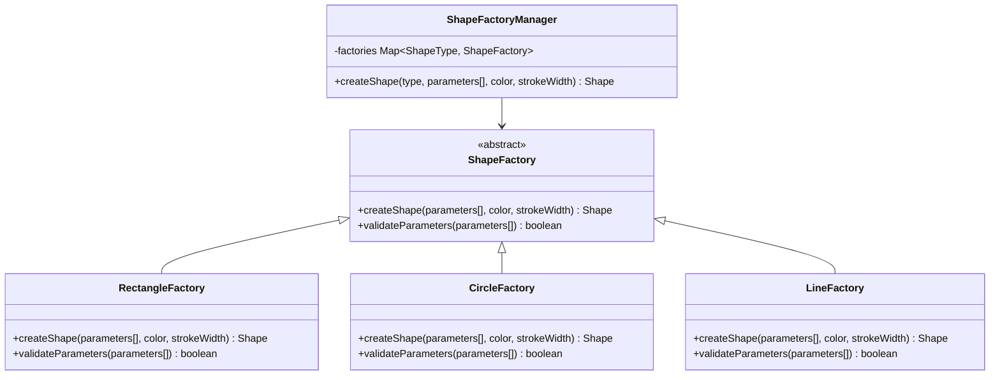
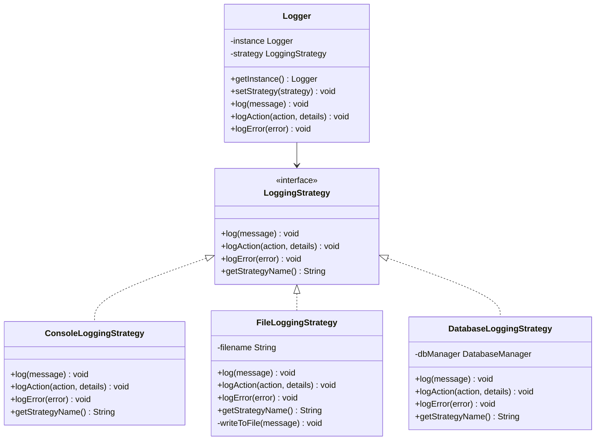
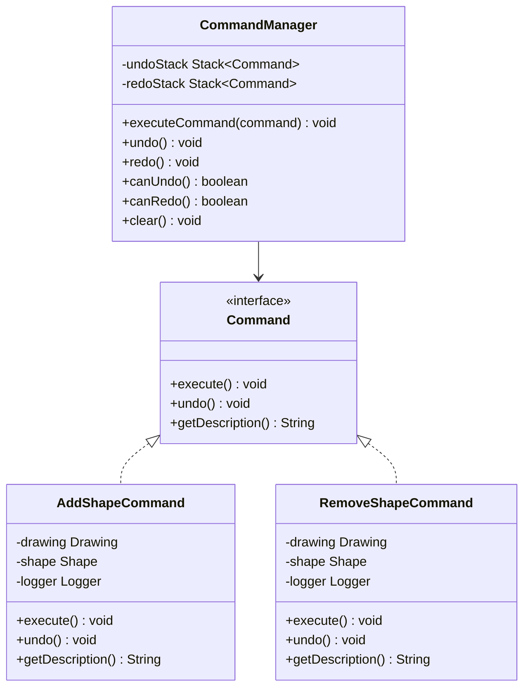
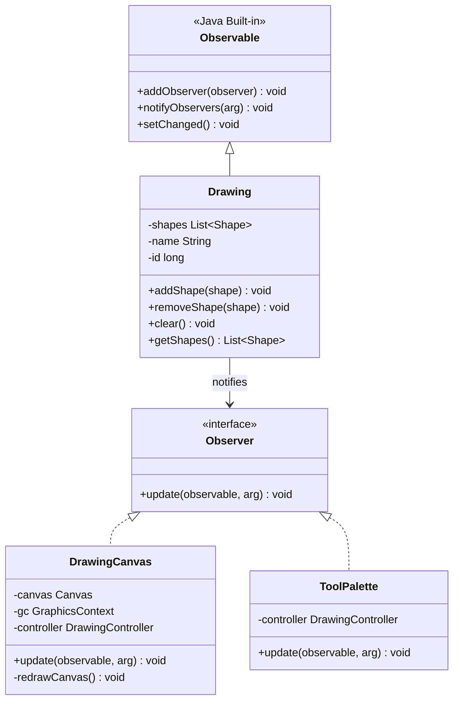
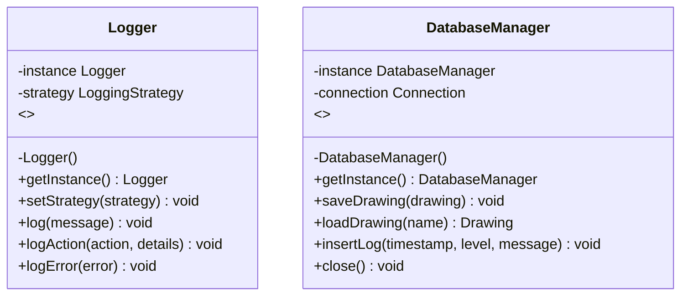
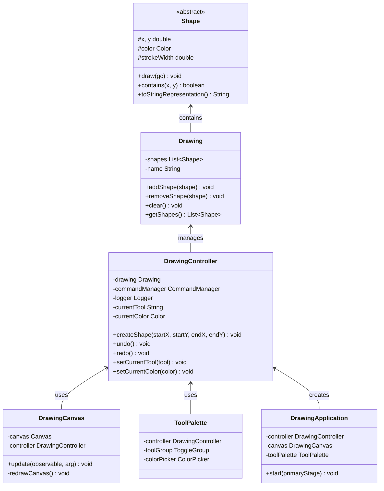

# JavaFX Drawing Application - Design Patterns

## Vue d'ensemble

Cette application de dessin JavaFX démontre l'utilisation de plusieurs patterns de conception (Design Patterns) pour créer une architecture logicielle robuste, maintenable et extensible.

## Patterns de Conception Utilisés

### 1. **Factory Method Pattern**

#### Description
Le Factory Method Pattern permet de créer des objets sans spécifier leur classe exacte. Il délègue la création d'objets à des sous-classes.

#### Implémentation dans le projet
- **Classes principales** : `ShapeFactory`, `ShapeFactoryManager`
- **Factories concrètes** : `RectangleFactory`, `CircleFactory`, `LineFactory`

#### Pourquoi ce pattern ?
- **Extensibilité** : Ajouter de nouveaux types de formes sans modifier le code existant
- **Séparation des responsabilités** : La logique de création est séparée de la logique métier
- **Validation** : Chaque factory valide ses propres paramètres

#### Diagramme de classe - Factory Method



---

### 2. **Strategy Pattern**

#### Description
Le Strategy Pattern définit une famille d'algorithmes, les encapsule et les rend interchangeables. Il permet de changer d'algorithme à l'exécution.

#### Implémentation dans le projet
- **Interface** : `LoggingStrategy`
- **Stratégies concrètes** : `ConsoleLoggingStrategy`, `FileLoggingStrategy`, `DatabaseLoggingStrategy`
- **Contexte** : `Logger`

#### Pourquoi ce pattern ?
- **Flexibilité** : Changer de méthode de journalisation à l'exécution
- **Extensibilité** : Ajouter facilement de nouvelles stratégies de logging
- **Séparation des préoccupations** : Chaque stratégie gère sa propre logique

#### Diagramme de classe - Strategy Pattern



---

### 3. **Command Pattern**

#### Description
Le Command Pattern encapsule une requête comme un objet, permettant de paramétrer les clients avec différentes requêtes, de mettre en file d'attente ou d'enregistrer les requêtes, et de supporter les opérations d'annulation.

#### Implémentation dans le projet
- **Interface** : `Command`
- **Commandes concrètes** : `AddShapeCommand`, `RemoveShapeCommand`
- **Invocateur** : `CommandManager`

#### Pourquoi ce pattern ?
- **Undo/Redo** : Implémentation facile des fonctionnalités d'annulation et de rétablissement
- **Historique** : Maintien d'un historique des actions
- **Découplage** : Séparation entre l'objet qui invoque l'opération et celui qui l'exécute

#### Diagramme de classe - Command Pattern



---

### 4. **Observer Pattern**

#### Description
Le Observer Pattern définit une dépendance un-à-plusieurs entre objets, de sorte que lorsqu'un objet change d'état, tous ses dépendants sont notifiés et mis à jour automatiquement.

#### Implémentation dans le projet
- **Observable** : `Drawing` (hérite de `java.util.Observable`)
- **Observers** : `DrawingCanvas`, `ToolPalette` (compteur de formes)

#### Pourquoi ce pattern ?
- **Synchronisation** : Mise à jour automatique de l'interface utilisateur
- **Découplage** : Le modèle ne connaît pas les détails de la vue
- **Réactivité** : L'interface réagit immédiatement aux changements du modèle

#### Diagramme de classe - Observer Pattern



---

### 5. **Singleton Pattern**

#### Description
Le Singleton Pattern assure qu'une classe n'a qu'une seule instance et fournit un point d'accès global à cette instance.

#### Implémentation dans le projet
- **Classes Singleton** : `Logger`, `DatabaseManager`

#### Pourquoi ce pattern ?
- **Ressources partagées** : Une seule instance de logger et de gestionnaire de base de données
- **Cohérence** : Garantit la cohérence des logs et des accès à la base de données
- **Performance** : Évite la création multiple d'objets coûteux

#### Diagramme de classe - Singleton Pattern



---

### 6. **Model-View-Controller (MVC) Pattern**

#### Description
Le MVC Pattern sépare l'application en trois composants interconnectés : le Modèle (données), la Vue (interface utilisateur) et le Contrôleur (logique métier).

#### Implémentation dans le projet
- **Model** : `Drawing`, `Shape` et ses sous-classes
- **View** : `DrawingApplication`, `DrawingCanvas`, `ToolPalette`, `StatusBar`
- **Controller** : `DrawingController`

#### Pourquoi ce pattern ?
- **Séparation des responsabilités** : Chaque composant a un rôle bien défini
- **Maintenabilité** : Modifications indépendantes de chaque couche
- **Réutilisabilité** : Le modèle peut être utilisé avec différentes vues

#### Diagramme de classe - MVC Pattern



---

## Architecture Globale

L'application combine tous ces patterns pour créer une architecture cohérente :

1. **Factory Method** crée les formes géométriques
2. **Strategy** gère les différentes méthodes de journalisation
3. **Command** permet l'undo/redo des actions
4. **Observer** synchronise la vue avec le modèle
5. **Singleton** gère les ressources partagées
6. **MVC** structure l'application en couches distinctes

## Avantages de cette Architecture

- **Extensibilité** : Facile d'ajouter de nouvelles formes, stratégies de logging, ou commandes
- **Maintenabilité** : Code organisé et responsabilités bien séparées
- **Testabilité** : Chaque composant peut être testé indépendamment
- **Réutilisabilité** : Les patterns peuvent être réutilisés dans d'autres projets
- **Flexibilité** : Changement de comportement à l'exécution (Strategy, Observer)

## Comment Exécuter l'Application

```bash
# Avec Maven
mvn clean compile javafx:run

# Ou avec le script fourni
./run.sh
```

## Tests

Un test du Factory Pattern est disponible :
```bash
# Windows
test_factory.bat

# Linux/Mac
javac -cp "." src/factory/*.java src/model/*.java src/test/TestFactoryPattern.java
java -cp "." test.TestFactoryPattern
```

---

## Détails d'Implémentation par Pattern

### Factory Method - Exemple d'utilisation

<augment_code_snippet path="src/controller/DrawingController.java" mode="EXCERPT">
````java
// Création d'une forme via le Factory Manager
case "RECTANGLE":
    double[] rectParams = {startX, startY, Math.abs(endX - startX), Math.abs(endY - startY)};
    shape = ShapeFactoryManager.createShape(ShapeFactoryManager.ShapeType.RECTANGLE, rectParams, currentColor, currentStrokeWidth);
    break;
````
</augment_code_snippet>

### Strategy - Changement de stratégie à l'exécution

<augment_code_snippet path="src/controller/DrawingController.java" mode="EXCERPT">
````java
public void setLoggingStrategy(String strategy) {
    LoggingStrategy loggingStrategy;

    switch (strategy) {
        case "CONSOLE":
            loggingStrategy = new ConsoleLoggingStrategy();
            break;
        case "FILE":
            loggingStrategy = new FileLoggingStrategy();
            break;
        case "DATABASE":
            loggingStrategy = new DatabaseLoggingStrategy();
            break;
        default:
            return;
    }

    logger.setStrategy(loggingStrategy);
    logger.logAction("CHANGE_LOGGING_STRATEGY", strategy);
}
````
</augment_code_snippet>

### Command - Exécution et annulation

<augment_code_snippet path="src/command/AddShapeCommand.java" mode="EXCERPT">
````java
@Override
public void execute() {
    drawing.addShape(shape);
    logger.logAction("ADD_SHAPE", shape.toStringRepresentation());
}

@Override
public void undo() {
    drawing.removeShape(shape);
    logger.logAction("UNDO_ADD_SHAPE", shape.toStringRepresentation());
}
````
</augment_code_snippet>

### Observer - Notification automatique

<augment_code_snippet path="src/model/Drawing.java" mode="EXCERPT">
````java
public void addShape(Shape shape) {
    shapes.add(shape);
    setChanged();
    notifyObservers("SHAPE_ADDED");
}
````
</augment_code_snippet>

### Singleton - Instance unique

<augment_code_snippet path="src/utils/Logger.java" mode="EXCERPT">
````java
public static Logger getInstance() {
    if (instance == null) {
        instance = new Logger();
    }
    return instance;
}
````
</augment_code_snippet>

---

## Conclusion

Cette application démontre comment les patterns de conception peuvent être combinés efficacement pour créer une architecture logicielle robuste. Chaque pattern résout un problème spécifique tout en contribuant à la cohérence globale du système.
